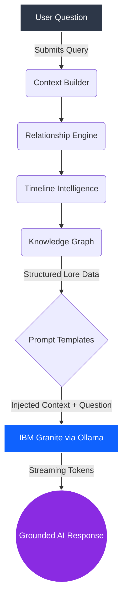
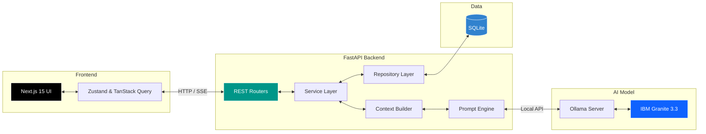

<div align="center">

# 🌌 LOREWEAVE

**AI Creative Simulation Engine for Intelligent Worldbuilding**

[](https://opensource.org/licenses/MIT)
[](#)
[](#)
[](#)

[Installation](#installation) • [Architecture](#system-architecture) • [Features](#features) • [Usage](#usage)

</div>

---

## 📖 Project Overview

**LOREWEAVE** is an AI-powered Creative Simulation Engine designed to enable writers, filmmakers, game designers, comic creators, and worldbuilders to create, organize, connect, and explore intelligent fictional universes.

The platform combines highly structured worldbuilding mechanics with advanced AI reasoning, utilizing **IBM Granite 3.3** running locally through **Ollama**. 

Instead of treating lore as isolated notes, creators build deeply interconnected worlds consisting of Universes, Characters, Locations, Organizations, World Objects, World Rules, Relationships, and Timeline Events. LOREWEAVE synthesizes this structured data into a Knowledge Graph and feeds it directly into an AI World Assistant, granting the AI a flawless, grounded understanding of your bespoke universe.

---

## ⚠️ Problem Statement

Creative professionals and hobbyist worldbuilders face significant challenges when developing complex fictional universes:

*   **Inconsistent Lore:** Keeping track of rules, magic systems, and physical laws across hundreds of pages.
*   **Continuity Errors:** Characters appearing in two places at once, or possessing items they haven't discovered yet.
*   **Disconnected Notes:** Traditional note-taking apps (like Notion or Obsidian) require immense manual effort to link entities.
*   **Scattered Documents:** Lore is often split between wikis, docs, and physical notebooks.
*   **Relationship Management:** Tracking how characters, factions, and locations feel about each other over time is nearly impossible.
*   **Timeline Inconsistencies:** Managing events chronologically across overlapping storylines.
*   **Creative Block:** Struggling to generate new ideas that strictly adhere to established lore.

**Why existing software fails:** Traditional wikis and note-taking apps are passive. They store text but cannot intelligently reason about the fictional world, cross-reference rules, or simulate "what-if" scenarios based on established relationships.

---

## 💡 Solution

**LOREWEAVE** solves these problems by moving from *passive note-taking* to *active simulation*:

*   **Structured Worldbuilding:** Every element (Character, Rule, Object) is treated as a distinct, typed entity rather than flat text.
*   **Knowledge Graph:** Entities are automatically linked via a dynamic graph, mapping the hidden connections in your universe.
*   **Timeline Intelligence:** Events are chronologically tracked, ensuring physical and temporal continuity.
*   **Relationship Engine:** Bidirectional tracking of how entities interact (e.g., Faction A is at war with Faction B).
*   **AI Assistant:** A conversational interface that understands your entire world.
*   **Context-Aware Reasoning:** The AI doesn't hallucinate; it reads your structured data before answering, acting as an infallible co-writer and lore-master.

---

## ✨ Features

LOREWEAVE is packed with features designed for production-level worldbuilding:

*   🪐 **Universe Management:** Create and isolate multiple independent story worlds.
*   👤 **Character Management:** Track traits, backstories, and affiliations.
*   🗺️ **Location Management:** Define climates, cultures, and populations.
*   🏛️ **Organization Management:** Build factions, guilds, and governments.
*   ⚔️ **World Objects:** Catalog artifacts, weapons, and significant items.
*   📜 **World Rules:** Establish magic systems, physics, and societal laws.
*   🔗 **Relationship Engine:** Define complex, bidirectional links between any two entities.
*   🕸️ **Knowledge Graph Visualization:** Visually explore the connections in your world via React Flow.
*   ⏱️ **Timeline Intelligence:** Plot historical and story events chronologically.
*   🤖 **AI World Assistant:** Chat with your universe to brainstorm, test logic, or summarize lore.
*   ⚡ **Streaming AI Chat:** Real-time token streaming for instantaneous AI feedback.
*   🔍 **Search, Filtering & Pagination:** Easily navigate massive wikis.
*   🗑️ **Soft Delete & Audit Logging:** Safely remove entities without breaking relational integrity.
*   📱 **Responsive UI & Dark Theme:** A premium, magical, glassmorphic UI optimized for all devices.
*   🏗️ **Production-ready Architecture:** Built on modern, scalable principles.

---

## 🛠️ Built with IBM Bob

> **IBM Bob was the PRIMARY AI-assisted development tool used throughout the creation of LOREWEAVE.**

IBM Bob acted as a senior pair-programmer, accelerating the development lifecycle. IBM Bob assisted with:

*   System architecture design
*   FastAPI backend development and asynchronous routing
*   Next.js frontend development and Tailwind styling
*   API generation and contract enforcement
*   Database schema design (SQLAlchemy/Alembic)
*   Testing and code quality (Pytest, Ruff)
*   Documentation and debugging

**Author's Note on AI Collaboration:**
While IBM Bob was instrumental in writing boilerplate, debugging complex streaming issues, and accelerating development, **all planning, architecture decisions, integration logic, validation, feature prioritization, and final implementation** were strictly directed, reviewed, and validated by the project author. IBM Bob functioned as an execution engine, but the creative vision and architectural scaffolding remain entirely human-driven.

---

## 🧠 IBM Granite (AI Engine)

LOREWEAVE is proudly powered by **IBM Granite 3.3 2B**, running entirely locally via **Ollama**.

**Why Local Inference?**
*   **Privacy:** Writers' intellectual property never leaves their machine.
*   **Offline Capability:** Worldbuild anywhere, without needing an internet connection.
*   **Low Latency:** Instantaneous streaming responses.
*   **Creator Ownership:** No reliance on third-party API subscriptions or rate limits.

**Grounded Context:**
Unlike standard ChatGPT prompts, Granite is fed a highly structured, dynamically generated context window. Before Granite answers a question, LOREWEAVE injects relevant Characters, Locations, Organizations, Objects, World Rules, Relationships, and Timeline Events directly into the prompt. This ensures Granite acts as a precise Lore-Master rather than a generic text generator.

---

## 🔄 AI Pipeline



---

## 🏗️ System Architecture



---

## 💻 Tech Stack

| Category | Technologies |
| :--- | :--- |
| **Frontend** | Next.js 15, React, TypeScript, Tailwind CSS, TanStack Query, Zustand |
| **Backend** | FastAPI, Python, SQLAlchemy (Async), Alembic, Pydantic, SQLite |
| **AI Inference** | IBM Granite 3.3 2B, Ollama |
| **Visualization** | React Flow (Knowledge Graph) |
| **Validation** | Zod, React Hook Form |
| **Quality/Testing** | Pytest, TypeScript, Ruff |

---

## 📂 Project Structure

<details>
<summary>Click to expand folder tree</summary>

```text
loreweave/
├── backend/
│   ├── alembic/              # Database migrations
│   ├── app/
│   │   ├── ai/               # Context building, Prompts, Provider logic
│   │   ├── api/              # FastAPI REST routers
│   │   ├── core/             # Config, Exceptions
│   │   ├── database/         # SQLite Async Session
│   │   ├── models/           # SQLAlchemy ORM Models
│   │   ├── repositories/     # Data Access Layer
│   │   ├── schemas/          # Pydantic validation schemas
│   │   └── services/         # Business logic
│   ├── tests/                # Pytest suites
│   ├── alembic.ini
│   └── requirements.txt
├── frontend/
│   ├── app/                  # Next.js App Router pages
│   ├── components/           # React UI components (Radix/Tailwind)
│   ├── hooks/                # Custom React Hooks & TanStack Query
│   ├── lib/                  # Utilities (Axios, cn)
│   ├── services/             # API client services
│   ├── styles/               # Global CSS & Tailwind config
│   ├── types/                # TypeScript interfaces
│   ├── package.json
│   └── next.config.ts
└── README.md
```
</details>

---

## 🚀 Installation

Follow these steps to run LOREWEAVE locally on your machine.

### 1. Clone the Repository
```bash
git clone https://github.com/YashYS04/loreweave.git
cd loreweave
```

### 2. Setup Ollama & IBM Granite
Install [Ollama](https://ollama.com/), then pull the Granite model:
```bash
ollama run granite3.3:2b
```
Keep the Ollama server running in the background.

### 3. Setup Backend
Open a new terminal and navigate to the backend directory:
```bash
cd backend
python -m venv .venv

# Windows
.\.venv\Scripts\activate
# Mac/Linux
source .venv/bin/activate

pip install -r requirements.txt

# Run database migrations
alembic upgrade head

# Start FastAPI server
python -m uvicorn app.main:app --port 8000 --reload
```

### 4. Setup Frontend
Open a new terminal and navigate to the frontend directory:
```bash
cd frontend
npm install

# Start Next.js development server
npm run dev
```

Visit `http://localhost:3000` in your browser.

---

## 🧭 Usage Walkthrough

1. **Create Universe:** Start by creating a new universe (e.g., "The Kingdom of Solara").
2. **Add Characters:** Define heroes, villains, and supporting casts.
3. **Add Locations & Organizations:** Map out your cities, terrain, guilds, and factions.
4. **Add Objects & Rules:** Define magical artifacts and the laws of physics/magic.
5. **Build Relationships:** Link entities together (e.g., "Character A *rules* Organization B").
6. **Create Timeline:** Sequence historical events to establish continuity.
7. **Visualize Graph:** Open the Knowledge Graph to see a web of your universe.
8. **Ask AI Assistant:** Open the AI Chat and ask, *"What would happen if Character A stole Object X?"* Watch as IBM Granite references your exact lore to provide a grounded, creative answer.

---

## 🗺️ Roadmap

- [ ] **Narrative Simulation:** Run "What-If" scenarios to see how factions react to events.
- [ ] **World Bible Export:** Generate a beautifully formatted PDF Wiki of the entire universe.
- [ ] **Collaborative Editing:** Multiplayer support for writer's rooms.
- [ ] **Version History:** Track changes to lore over time.
- [ ] **Cloud Sync:** Optional secure cloud backups while keeping AI local.
- [ ] **Multiplayer Story Design:** Work with your team simultaneously on world elements.

---

## 🤝 Contributing

Contributions are what make the open source community such an amazing place to learn, inspire, and create. Any contributions you make are **greatly appreciated**.

1. Fork the Project
2. Create your Feature Branch (`git checkout -b feature/AmazingFeature`)
3. Commit your Changes (`git commit -m 'Add some AmazingFeature'`)
4. Push to the Branch (`git push origin feature/AmazingFeature`)
5. Open a Pull Request

---

## 📄 License

Distributed under the MIT License. See `LICENSE` for more information.

---

## ✍️ Author

**Yash Sakhare**

*   GitHub: [@YashYS04](https://github.com/YashYS04)
*   LinkedIn: [yash-sakhare04](https://www.linkedin.com/in/yash-sakhare04/)
